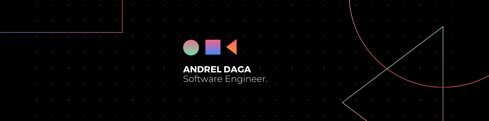

# Hi there, I'm Andrel! 👋

## About Me 🚀

I'm a passionate **Software Engineer** with experience in **Full-Stack development**. I love tackling complex problems, learning new skills, and collaborating with diverse teams to create innovative solutions.

- 🌱 Currently learning: **Advanced Back End Development at ALX**
- 🔭 Working on: **Zenith** - An esports tournament hosting platform
- 🌍 Languages: **English, French**
- 📫 How to reach me: **variabledev1@gmail.com**
- ⚡ Fun fact: **When I was 16 years old, my dream was to play in the NBA**

## My Skills 🧠

## Get in Touch 📬

- **[LinkedIn]**(https://www.linkedin.com/in/andrel-daga/)

